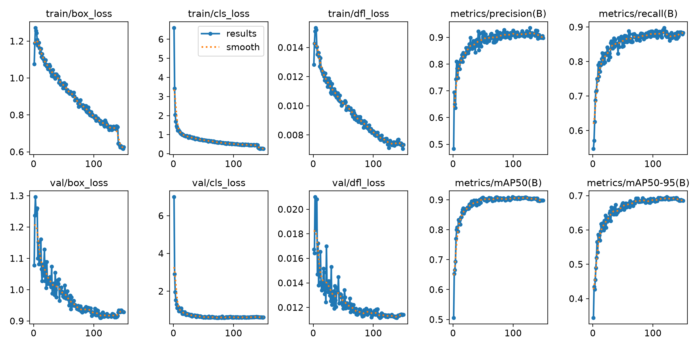
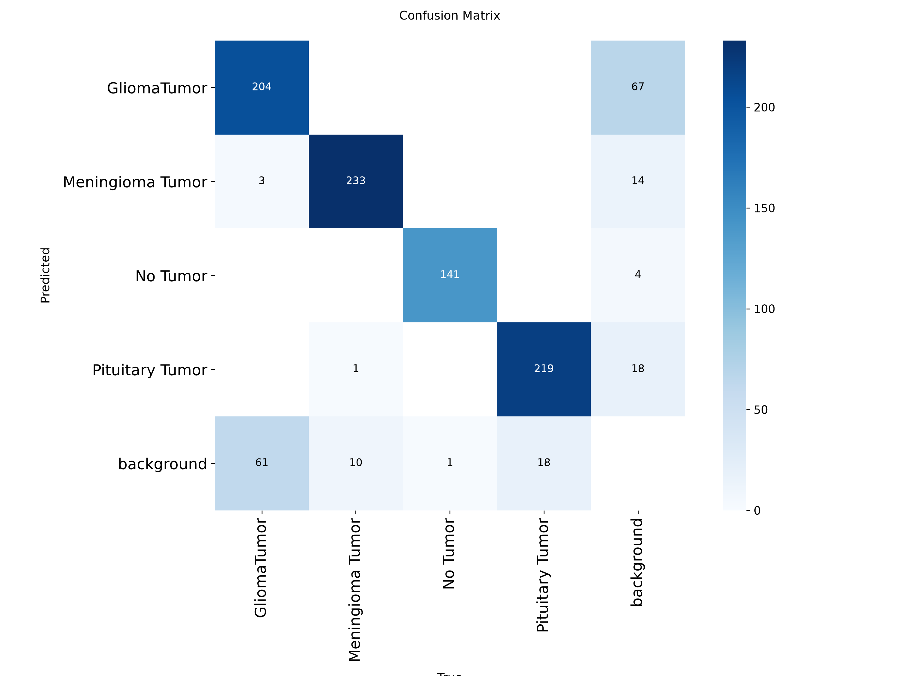
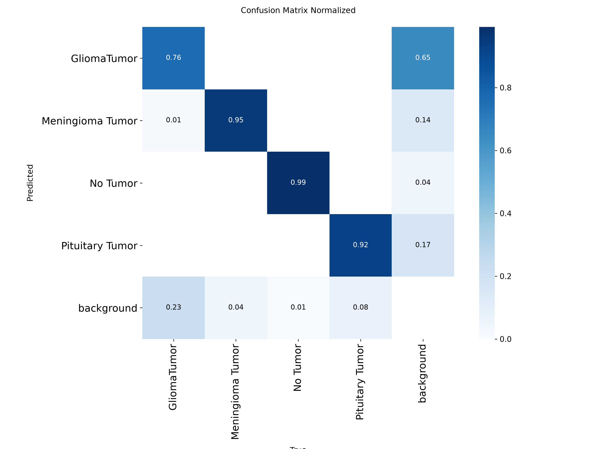
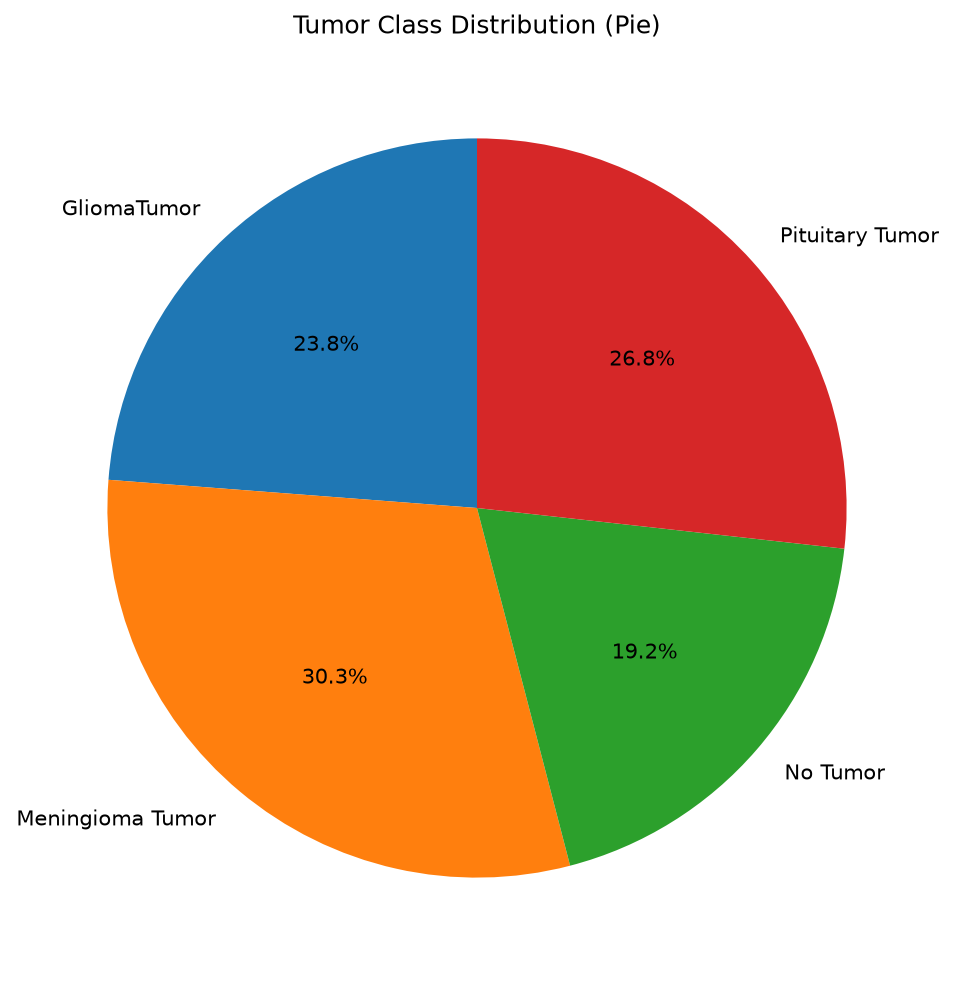
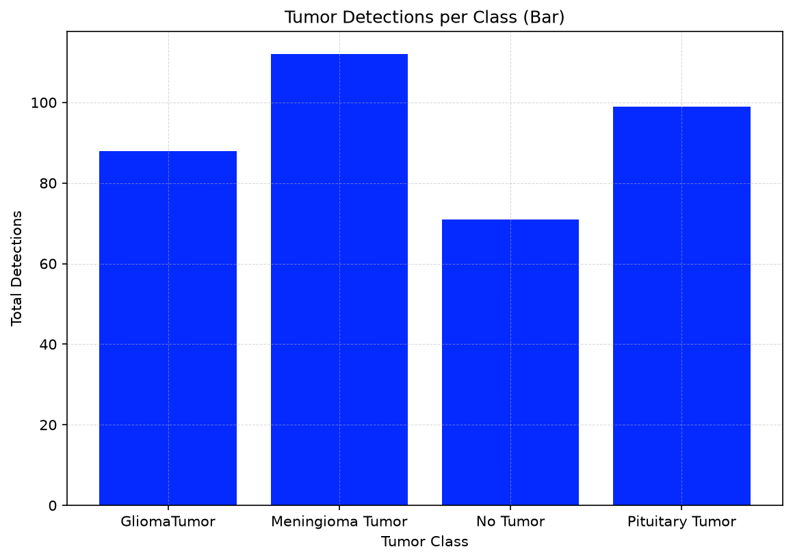
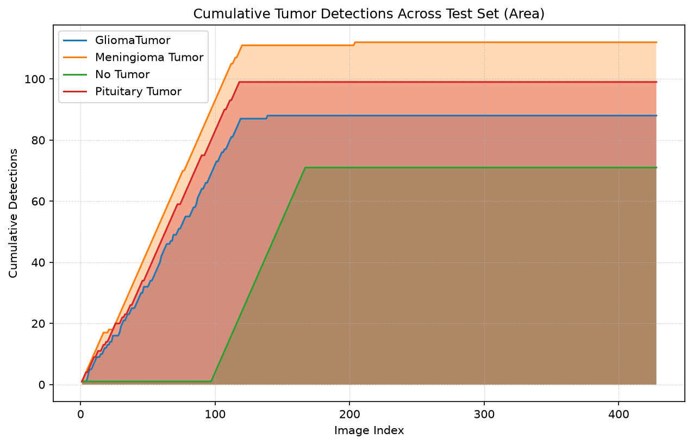

# 🧠 Brain Tumor Detection & Segmentation

Custom-trained **YOLO26n** object detector for classifying brain tumors from MRI scans, extended with a **SAM (Segment Anything)**-based pipeline to produce exact pixel-level tumor boundaries, plus an analytics module for summarizing results across a test set.

> ⚠️ **Disclaimer:** This project is a personal/educational computer vision exercise. It is **not a validated medical device** and must not be used for clinical diagnosis or treatment decisions.

---

## Table of Contents

- [Overview](#overview)
- [Example Predictions](#example-predictions)
- [Dataset](#dataset)
- [Model & Training](#model--training)
- [Hardware & Training Constraints](#hardware--training-constraints)
- [Results](#results)
- [Detection + Segmentation Pipeline](#detection--segmentation-pipeline)
- [Analytics Module](#analytics-module)
- [Repository Structure](#repository-structure)
- [Setup](#setup)
- [Usage](#usage)
- [Limitations & Future Work](#limitations--future-work)
- [Acknowledgments](#acknowledgments)

---

## Overview

This project detects and classifies four categories of brain MRI findings using a YOLO26n object detector, then feeds each detected region into MobileSAM to segment the precise shape of the tumor rather than just a bounding box.

**Classes:**
| Class | Description |
|---|---|
| `GliomaTumor` | Glioma tumor |
| `Meningioma Tumor` | Meningioma tumor |
| `No Tumor` | Healthy / no tumor present |
| `Pituitary Tumor` | Pituitary tumor |

**Pipeline at a glance:**

```
MRI image → YOLO26n (best.pt) → bounding box + class + confidence
                                        │
                                        ▼
                          MobileSAM (box-prompted segmentation)
                                        │
                                        ▼
                     Pixel-level tumor mask + area + centroid
                                        │
                                        ▼
                       Analytics (pie / bar / area charts)
```

---

## Example Predictions

<p align="center">
  
  
</p>
<p align="center">
  
  
</p>

Detections are shown across axial and sagittal MRI slices, with class label and confidence overlaid on each bounding box.

---

## Dataset

- **Source:** [Roboflow Universe – BrainTumorDetection](https://universe.roboflow.com/firstworkspace-qsq1i/braintumordetection-agfcl) (dataset version 3)
- **Size:** 4,283 images across train/valid/test splits
- **License:** CC BY 4.0
- **Classes:** 4 (`GliomaTumor`, `Meningioma Tumor`, `No Tumor`, `Pituitary Tumor`)

`data.yaml`:
```yaml
train: ../train/images
val: ../valid/images
test: ../test/images
nc: 4
names: ['GliomaTumor', 'Meningioma Tumor', 'No Tumor', 'Pituitary Tumor']
roboflow:
  workspace: firstworkspace-qsq1i
  project: braintumordetection-agfcl
  version: 3
  license: CC BY 4.0
  url: https://universe.roboflow.com/firstworkspace-qsq1i/braintumordetection-agfcl/dataset/3
```

---

## Model & Training

- **Base model:** `yolo26n.pt` (Ultralytics YOLO26, nano variant — chosen for fast inference and a small footprint suited to limited local GPU VRAM)
- **Experiment tracking:** Full run logged on [Comet ML](https://www.comet.com/pruthvi423186/brain-tumor/6097d48af5df4ec38b137ca0a00cc561) (loss curves, metrics, system usage, all 150 epochs)

Key training configuration (`Runs/args.yaml`):

| Parameter | Value |
|---|---|
| Epochs | 150 |
| Patience (early stopping) | 50 |
| Image size | 640 |
| Batch size | 8 |
| Optimizer | auto (SGD/AdamW auto-selected) |
| LR schedule | Cosine LR (`cos_lr=True`), `lr0=0.01`, `lrf=0.01` |
| AMP (mixed precision) | **Disabled** (`amp=False`) |
| Cache | Disk (`cache="disk"`) |
| Close mosaic | Last 10 epochs |
| Augmentations | HSV jitter, translate 0.1, scale 0.5, horizontal flip 0.5, mosaic 1.0, RandAugment, random erasing 0.4 |
| Device | Single GPU (`device=0`) |
| Workers | 4 |
| Seed | 0 (deterministic) |

Training script: [`Python/train_yolo26n.py`](Python/train_yolo26n.py)

---

## Hardware & Training Constraints

Training was run **locally on a Windows machine with an NVIDIA RTX 2050 (4GB VRAM)** laptop GPU. This introduced several real constraints that shaped the final training configuration:

- **Limited VRAM (4GB):** capped batch size at 8 for a 640×640 input — larger batches caused CUDA out-of-memory errors.
- **AMP disabled:** automatic mixed precision was turned off (`amp=False`) after it caused instability/compatibility issues on this GPU + Windows + driver combination; training ran in full precision instead, which is slower but more stable.
- **Disk caching instead of RAM caching:** `cache="disk"` was used instead of caching images in RAM, since available system memory was a limiting factor for image caching.
- **Windows multiprocessing quirks:** running YOLO training/inference from Jupyter notebooks on Windows surfaced `DataLoader` worker/multiprocessing issues (Windows uses `spawn` rather than `fork`), which affected GPU utilization consistency during experimentation. `workers=4` was chosen as a stable middle ground after testing.
- **Total training time:** ~6.2 hours for the full 150 epochs (~2.5 minutes/epoch) on the RTX 2050.
- **Full 150 epochs completed:** early stopping patience of 50 was never triggered, meaning validation metrics were still (very slowly) improving/stable through the full schedule rather than plateauing early.

---

## Results

Final metrics (epoch 150, from `Runs/results.csv`):

| Metric | Value |
|---|---|
| Precision | 0.898 |
| Recall | 0.884 |
| mAP@50 | 0.898 |
| mAP@50-95 | 0.686 |

### Training curves



All three training losses (box, cls, dfl) decrease smoothly with no divergence. Validation losses flatten out with some batch-to-batch noise, consistent with a modestly-sized validation split.

### Confusion Matrix

<p align="center">
  
  
</p>

### Per-class recall (from the normalized confusion matrix)

| Class | Recall |
|---|---|
| No Tumor | 0.99 |
| Meningioma Tumor | 0.95 |
| Pituitary Tumor | 0.92 |
| **GliomaTumor** | **0.76** |

**GliomaTumor is the clear weak point.** ~23% of true glioma cases are missed entirely, and when the model does raise a false positive on a background (non-tumor) region, 65% of those false positives are labeled `GliomaTumor`. This is consistent with gliomas typically having irregular, infiltrative margins compared to the more clearly demarcated meningioma and pituitary tumors — likely a mix of genuine visual ambiguity and glioma annotation/boundary variability in the source dataset.

Additional standard YOLO evaluation plots (`Runs/`): `BoxF1_curve.png`, `BoxPR_curve.png`, `BoxP_curve.png`, `BoxR_curve.png`, `labels.jpg`, training/validation batch mosaics (`train_batch*.jpg`, `val_batch*_labels.jpg`, `val_batch*_pred.jpg`).

---

## Detection + Segmentation Pipeline

A pretrained segmentation model trained on COCO classes (e.g. a generic YOLO-seg model) has no concept of "tumor," so it can't be used directly. Instead, this project combines:

1. **`best.pt`** (the custom-trained YOLO26n detector) — detects the tumor, classifies it, and returns a bounding box.
2. **MobileSAM** (`mobile_sam.pt`, pretrained, class-agnostic) — takes that bounding box as a **prompt** and segments the exact pixel boundary of whatever is inside it, with zero tumor-specific training required.

This gives pixel-level tumor masks (not just boxes), along with derived stats: mask pixel area, % of image occupied, and centroid location.

**Why MobileSAM specifically:**

| Model | Size | Params | Notes |
|---|---|---|---|
| **MobileSAM** ✅ | 40.7 MB | 10.1M | Fast, low VRAM — good fit for a single clear ROI per box |
| FastSAM | 23.7 MB | 11.8M | Faster still, but slightly less precise on fine/irregular edges |
| SAM (sam_b) | 375 MB | 93.7M | More precise masks, much slower, heavier on VRAM |
| SAM2-t / SAM2-b | 78–162 MB | 39–81M | Good middle ground if MobileSAM masks look too rough |
| SAM3 | 3.4 GB | 473.6M | Overkill for box-prompted segmentation; unlikely to fit in 4GB VRAM |

Given the RTX 2050's 4GB VRAM budget, MobileSAM was chosen as the default. `sam2_t.pt` is a drop-in upgrade (same API) if mask precision on glioma's irregular margins needs improving.

Script: [`Python/ob_seg.py`](Python/ob_seg.py)

---

## Analytics Module

After running detection + segmentation across a test batch, the pipeline aggregates results into three summary charts (built with matplotlib, since `ultralytics.solutions.Analytics` is designed for video/tracking streams rather than a static image folder):

<p align="center">
  
  
  
</p>

- **Pie chart** — proportion of each tumor class detected across the test set
- **Bar chart** — total detection count per class
- **Area chart** — cumulative detections per class as the test set is processed image-by-image

---

## Repository Structure

```
Brain-tumor-detection/
├── Analytics/                     # Summary charts from batch inference
│   ├── analytics_pie.png
│   ├── analytics_bar.png
│   └── analytics_area.png
├── Example predictions/           # Sample annotated MRI predictions
│   ├── Pred_eg1.jpg
│   ├── Pred_eg2.jpg
│   ├── Pred_eg3.jpg
│   └── Pred_eg4.jpg
├── Python/
│   ├── train_yolo26n.py           # Training script (Comet ML + Ultralytics)
│   ├── Pred_single_img.py         # Single-image inference
│   ├── Pred_mul_img.py            # Batch inference (50+ images)
│   └── ob_seg.py                  # Detection + SAM segmentation + analytics
├── Runs/
│   ├── weights/
│   │   ├── best.pt                # Best checkpoint (5.2MB)
│   │   └── last.pt
│   ├── results.png                # Training/validation curves
│   ├── results.csv                # Per-epoch metrics log
│   ├── confusion_matrix.png
│   ├── confusion_matrix_normalized.png
│   ├── BoxF1_curve.png / BoxPR_curve.png / BoxP_curve.png / BoxR_curve.png
│   ├── labels.jpg
│   ├── train_batch*.jpg / val_batch*_labels.jpg / val_batch*_pred.jpg
│   └── args.yaml                  # Full training hyperparameters
└── README.md
```

---

## Setup

```bash
pip install ultralytics comet_ml opencv-python matplotlib numpy
```

MobileSAM weights (`mobile_sam.pt`) auto-download on first use via the Ultralytics `SAM` class.

## Usage

**Train from scratch:**
```bash
python Python/train_yolo26n.py
```
(Update the Comet ML `api_key`/`workspace` placeholders and the `data.yaml` path before running.)

**Single image inference:**
```bash
python Python/Pred_single_img.py
```

**Batch inference (50+ images):**
```bash
python Python/Pred_mul_img.py
```

**Detection + segmentation + analytics:**
```bash
python Python/ob_seg.py
```
Update `DETECTION_MODEL_PATH` and `TEST_DIR` at the top of the script to point at your local `best.pt` and test image folder.

---

## Limitations & Future Work

- **GliomaTumor recall (0.76)** is the main weakness — the highest-leverage next step is auditing glioma annotation tightness in the source dataset and/or targeted oversampling.
- **4GB VRAM ceiling** limited batch size and ruled out heavier segmentation backbones (SAM3, full SAM) without further optimization (e.g. TensorRT INT8 quantization, smaller input resolution).
- **2D single-slice inference only** — no volumetric/3D context across MRI slice stacks, which could improve consistency for irregular tumors like glioma.
- **MobileSAM masks are only as good as the detector's box** — if `best.pt` misses a tumor, segmentation never runs on it.
- Potential upgrades: SAM2-t for sharper glioma boundaries, ONNX/TensorRT export for faster local inference, and expanding the analytics module to true video-based Ultralytics `solutions.Analytics` if extended to video-stream use cases.

---

## Acknowledgments

- [Ultralytics YOLO26](https://docs.ultralytics.com/) — detection framework
- [Segment Anything (SAM) / MobileSAM](https://docs.ultralytics.com/models/mobile-sam/) — promptable segmentation
- [Roboflow Universe](https://universe.roboflow.com/firstworkspace-qsq1i/braintumordetection-agfcl) — dataset (CC BY 4.0)
- [Comet ML](https://www.comet.com/) — experiment tracking
